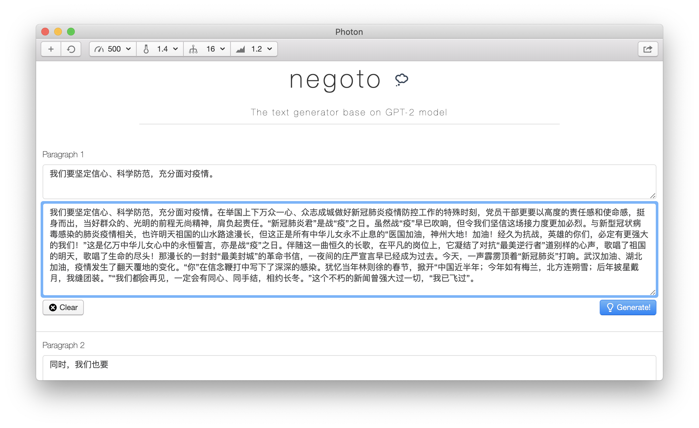
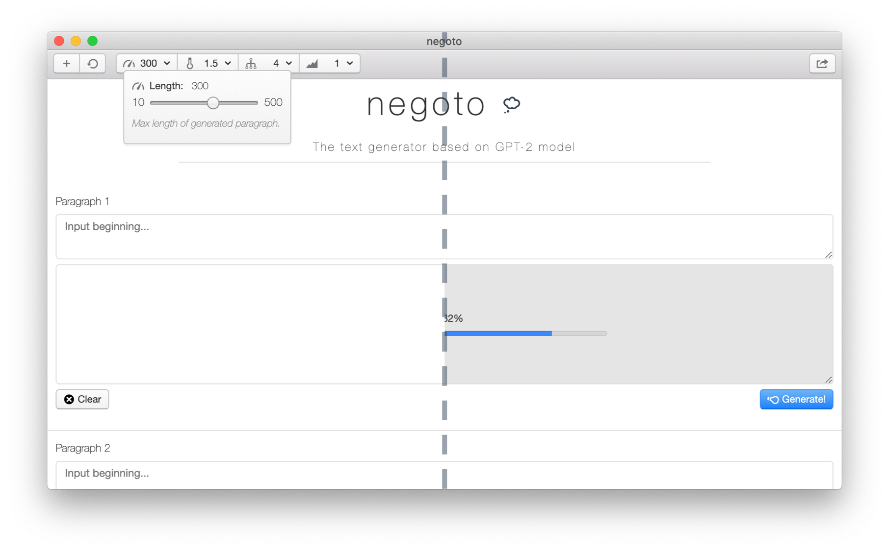

# negoto

**The text generator based on GPT-2 model.**

*This work is a part of course project of IS305, spring, 2020.*

***Features:***

* Generate text paragraph by paragraph, by giving the beginning words.

* GPT-2 model as backend generator, the power of NLG maybe not "too dangerous" but still fascinating.

* Adjust parameters, edit paragraphs, and export article with clicking in GUI, no need to worry the AI model.

---
## Usage

Type beginning, set parameters, then click Generate!

### Model Highlights

* **GPT-2 124M model** of 400MB size and 21k vocabularies. See [submodule GPT2-Chinese](https://github.com/nyLiao/GPT2-Chinese) for more information.

* **Training details:** Fine-tune on 20MB general application articles for 10 epochs by my own. Pre-train on 130MB Chinese prose articles for 10 epochs by [hughqiu](https://github.com/hughqiu).

* **Coherent generation:** To preserve article coherence between paragraphs, rewrite generation methods to store model past states and generate output based on it. This also boost generation speed.

### Application Highlights

* **GUI operations:** Add paragraphs, clear all (also clear model states) or single output, and regenerate functions for combining an entire article. Four generation parameters (max length, temperature, top-k, and top-p) adjustments for language styles and more. After generation, export to txt file by one click.

* **Ready-to-use texts:** Text format are arranged to form an article: paragraphs ended as sentences end, only masked numbers and proper nouns are marked blank. Also, app will handle blank/short beginnings as article starts.

* **Cross-language communication:** Apache Thrift for Python-Node.js server-client service. Also Node.js `stdout` for progress bar feature.

## Requirements

### Develop environment

Python 3.7 + Node 12.1, Mac OS X 10.15.

#### Python

* Thrift 0.13.0: `pip install thrift`.

* Mainly `torch, transformers` to run `generate_class.py`. Refer to `requirements.txt` in [submodule GPT2-Chinese](https://github.com/nyLiao/GPT2-Chinese) for details.

* Training corpus and trained models not provided yet. Contact author if neccessary.

#### Node and Electron

* [Electron](https://github.com/electron/electron) 8.2.1.

* Thrift 0.12.0: `npm install thrift`.

* For full node modules dependencies, refer to [`package.json`](../package.json) and install by `npm install`.

* [Electron-builder](https://github.com/electron-userland/electron-builder) not implemented yet. Currently launch application by `electron .` or `npm start`.

## Examples

See [examples.md](../outputs/examples.md) for examples.

## TODO

* [ ] Better UI and more operating functions.

* [ ] Better generation effects. Deeper model (maybe GPT-2 355M or above) and more abundant corpus.

* [ ] Better generation performance. Consider compressing model size and optimizing for generation.

## Acknowledgements and References

* :octocat: [openai/gpt-2](https://github.com/openai/gpt-2)

* :octocat: [Morizeyao/GPT2-Chinese](https://github.com/Morizeyao/GPT2-Chinese)

* :octocat: [szwacz/electron-boilerplate](https://github.com/szwacz/electron-boilerplate)

* :octocat: [connors/photon](https://github.com/connors/photon)

* :octocat: [apache/thrift](https://github.com/apache/thrift)

* :octocat: [menzi11/BullshitGenerator](https://github.com/menzi11/BullshitGenerator)

## License

**NOTE: Academic develop only. Please use this project and generated text properly. Author do not take any responsibility for text generated and/or any form of its usage.**

See [`LICENSE`](../LICENSE) for licensing information.

